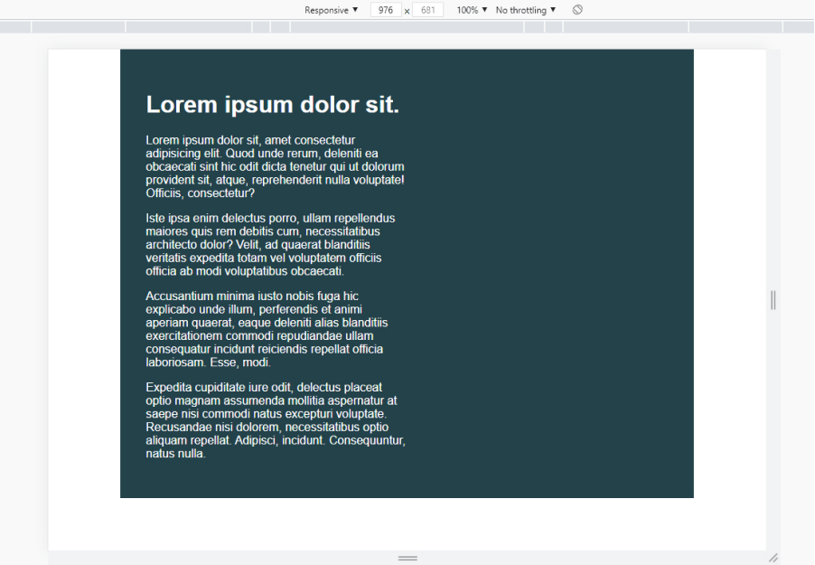

# Tips - day one
* try to avoid to set heights
* use percentages for widths instead of fixed pixels
* percentages widths on child elements

## Challenge
- [x] Limit the total width of the intro-conent to about half of it's parent
- [x] Stop the text from overflowing out the bottom at small screen widths

## image
