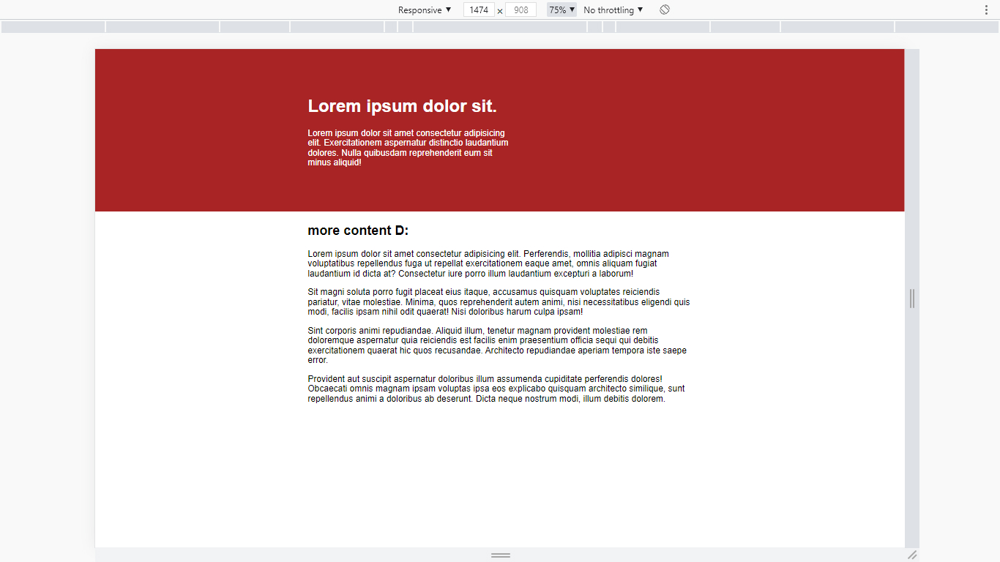

# Tips & tricks - day three
- using max-width

## Challenges

- [x] Keep the text inside .intro-content in the same place, but have the background extend from one side of the viewport to the other, no matter how wide or narrow the browser is.
- [x] Limit the maximum width of the text in the bottom area.

## image
