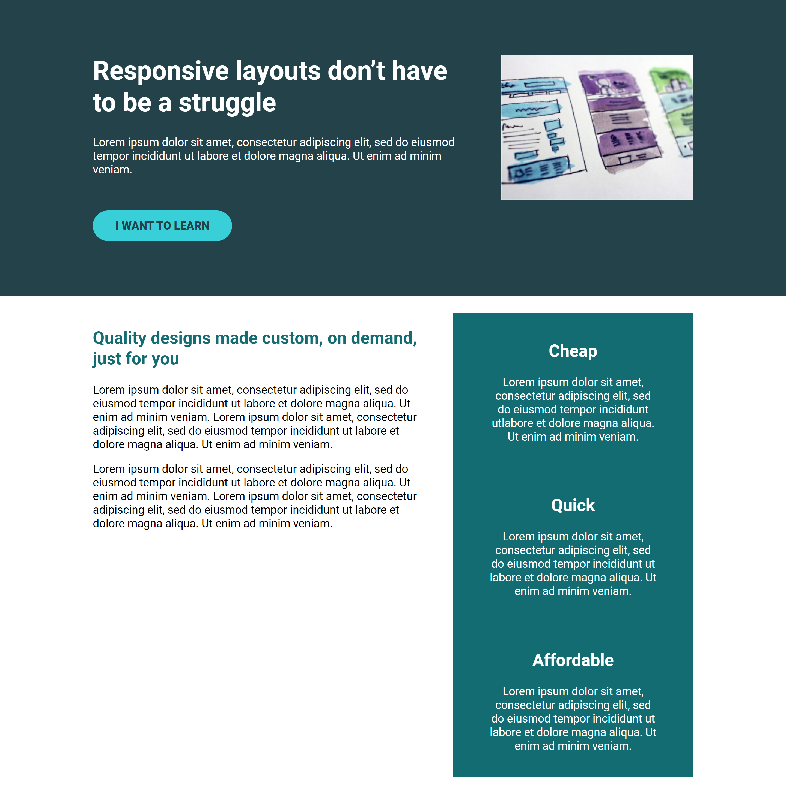

# Tips & tricks - day nine
- set column width
- align-self

## Challenges
- [x] Complete the interface
- [x] Refer to the design specs for the overall layout 
- [x] The image should line up with the sidebar in the section below

## image
